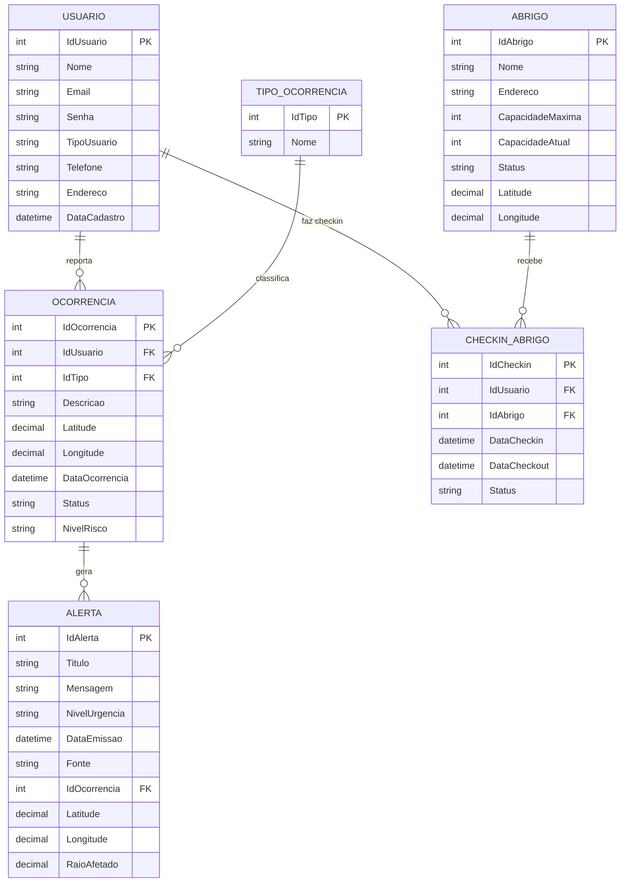
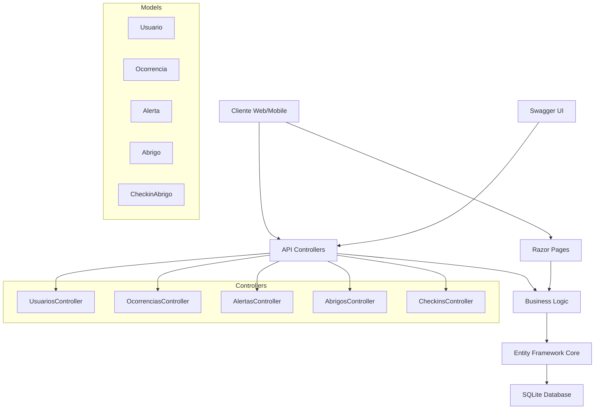

# SafeDrop - Emergency Management API

## 📋 Descrição do Projeto

Sistema completo de gerenciamento de emergências desenvolvido em .NET 9 com ASP.NET Core, Entity Framework e Razor Pages. A solução oferece uma API REST robusta para auxiliar pessoas em situações de extrema urgência, permitindo o cadastro de ocorrências, alertas, usuários e abrigos.

## 🎥 Vídeos

* Vídeo Desmontração do Projeto: https://www.youtube.com/watch?v=BqIK2Jfdc1M
* Vídeo Pitch: https://youtu.be/_b8kgfBJzeU

## 👥 Equipe

* Membros da Equipe: 
* Afonso Correia Pereira - RM557863
* Adel Mouhaidly - RM557705
* Tiago Augusto Desiderato - RM558485
* GitHub: https://github.com/afonsocp/SafeDrop.NET

## 🏗️ Arquitetura do Sistema

### Diagrama de Entidades



### Diagrama de Arquitetura



## 🚀 Tecnologias Utilizadas

* .NET 9.0
* ASP.NET Core - Framework web
* Entity Framework Core - ORM
* SQLite - Banco de dados
* Swagger/OpenAPI - Documentação da API
* Razor Pages - Interface web
* Bootstrap 5 - Framework CSS
* Font Awesome - Ícones

## 📦 Estrutura do Projeto

```
EmergencyManagementAPI/
├── Controllers/           # Controllers da API REST
│   ├── AlertasController.cs
│   ├── OcorrenciasController.cs
│   ├── UsuariosController.cs
│   ├── AbrigosController.cs
│   └── CheckinsAbrigosController.cs
├── Models/               # Modelos de dados
│   ├── Alerta.cs
│   ├── Ocorrencia.cs
│   ├── Usuario.cs
│   ├── Abrigo.cs
│   └── CheckinAbrigo.cs
├── DTOs/                 # Data Transfer Objects
│   ├── AlertaDto.cs
│   ├── OcorrenciaDto.cs
│   └── UsuarioDto.cs
├── Data/                 # Contexto do banco
│   └── ApplicationDbContext.cs
├── Pages/                # Razor Pages
│   ├── Alertas/
│   ├── Ocorrencias/
│   ├── Usuarios/
│   └── Shared/
├── Migrations/           # Migrações do EF
└── wwwroot/             # Arquivos estáticos
```

## ⚙️ Configuração e Instalação

### Pré-requisitos

* .NET 9.0 SDK
* Visual Studio 2022 ou VS Code
* Git

### Passos para Instalação

Clone o repositório:

```bash
git clone https://github.com/seu-usuario/emergency-management-api.git
cd emergency-management-api
```

Restaure as dependências:

```bash
dotnet restore
```

Execute as migrações:

```bash
dotnet ef database update
```

Execute o projeto:

```bash
dotnet run
```

Acesse a aplicação:

* Interface Web: [https://localhost:7000](https://localhost:7000)
* API Swagger: [https://localhost:7000/swagger](https://localhost:7000/swagger)

## 📖 Documentação da API

### Endpoints Principais

**Usuários**

* GET /api/usuarios
* GET /api/usuarios/{id}
* POST /api/usuarios
* PUT /api/usuarios/{id}
* DELETE /api/usuarios/{id}

**Ocorrências**

* GET /api/ocorrencias
* GET /api/ocorrencias/{id}
* POST /api/ocorrencias
* PUT /api/ocorrencias/{id}

**Alertas**

* GET /api/alertas
* GET /api/alertas/{id}
* POST /api/alertas
* GET /api/alertas/nivel/{nivel}

## 🧪 Testes

### Testes da API com Postman

**1. Criar Usuário**

```http
POST https://localhost:7000/api/usuarios
Content-Type: application/json

{
  "nome": "João Silva",
  "email": "joao@email.com",
  "senha": "123456",
  "tipoUsuario": "cidadao",
  "telefone": "11999999999",
  "endereco": "Rua das Flores, 123"
}
```

**2. Criar Ocorrência**

```http
POST https://localhost:7000/api/ocorrencias
Content-Type: application/json

{
  "idUsuario": 1,
  "idTipo": 1,
  "descricao": "Alagamento na Rua Principal",
  "latitude": -23.5505,
  "longitude": -46.6333,
  "nivelRisco": "alto"
}
```

**3. Criar Alerta**

```http
POST https://localhost:7000/api/alertas
Content-Type: application/json

{
  "titulo": "Alerta de Alagamento",
  "mensagem": "Evite a região da Rua Principal devido ao alagamento",
  "nivelUrgencia": "alto",
  "idOcorrencia": 1,
  "fonte": "Defesa Civil"
}
```

### Testes Funcionais

**Cenário 1: Fluxo Completo de Emergência**

* Cadastrar usuário via interface web
* Reportar ocorrência com localização
* Gerar alerta automático baseado na ocorrência
* Verificar notificação na dashboard

**Cenário 2: Gestão de Abrigos**

* Cadastrar abrigo com capacidade
* Fazer check-in de usuário
* Verificar ocupação em tempo real
* Fazer check-out quando necessário

### Validações Implementadas

* Campos obrigatórios: Nome, email, descrição
* Formatos válidos: Email, telefone
* Níveis de urgência: baixo, medio, alto, critico
* Status válidos: ativo, inativo, resolvido
* Capacidade de abrigos: Não pode exceder máximo

## 🔧 Funcionalidades Principais

**1. Gestão de Usuários**

* Cadastro de cidadãos, voluntários e órgãos públicos
* Autenticação e autorização
* Perfis diferenciados por tipo

**2. Registro de Ocorrências**

* Reportar emergências com geolocalização
* Classificação por tipo e nível de risco
* Acompanhamento de status

**3. Sistema de Alertas**

* Alertas automáticos baseados em ocorrências
* Diferentes níveis de urgência
* Notificações por região

**4. Dashboard Administrativo**

* Visualização de estatísticas
* Monitoramento em tempo real
* Relatórios de emergências

## 🛡️ Segurança

* Validação de entrada em todos os endpoints
* Sanitização de dados para prevenir XSS
* CORS configurado para APIs externas
* HTTPS obrigatório em produção

## 📊 Monitoramento

* Logs estruturados com Serilog
* Health checks para APIs
* Métricas de performance
* Alertas de sistema

## 🚀 Deploy

**Ambiente de Desenvolvimento**

```bash
dotnet run --environment Development
```

**Ambiente de Produção**

```bash
dotnet publish -c Release
dotnet EmergencyManagementAPI.dll
```
